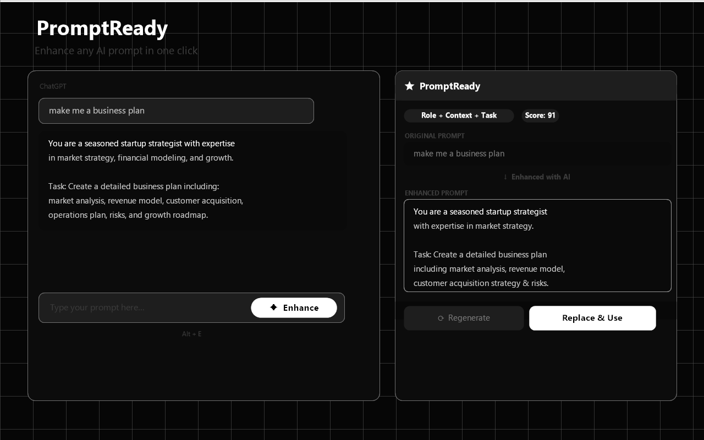
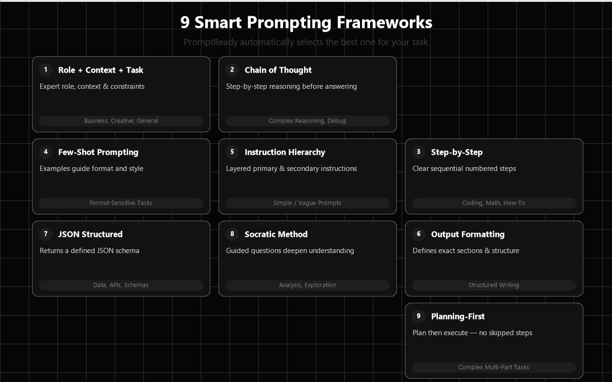
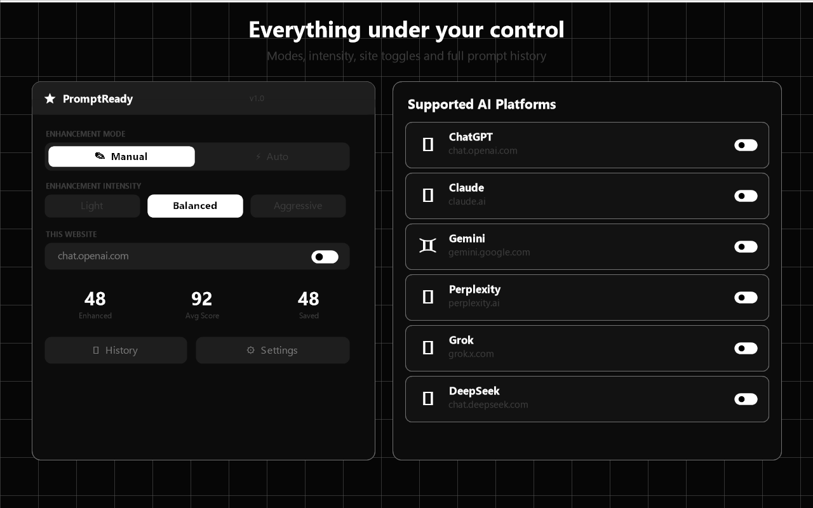

<div align="center">

# ✦ PromptReady

### AI Prompt Enhancer Chrome Extension

**Automatically rewrites your vague prompts into structured, expert-level prompts using 9 proven frameworks — before you hit send.**

[](https://chrome.google.com/webstore)
[](https://developer.chrome.com/docs/extensions/mv3/)
[](LICENSE)
[](manifest.json)

</div>

---

## 📸 Screenshots

| Before / After | 9 Frameworks | Settings |
|---|---|---|
|  |  |  |

---

## 🚀 What It Does

Most people write weak, vague prompts like:

> *"make me a business plan"*

PromptReady transforms it into:

> *"You are a seasoned startup strategist with expertise in market strategy. Create a detailed business plan including market analysis, revenue model, customer acquisition strategy, operations plan, risks, and growth roadmap. Format with clear headings and actionable steps."*

It works **100% locally** — no API calls, no server, no account needed.

---

## 🌐 Supported AI Platforms

| Platform | URL |
|---|---|
| 🤖 ChatGPT | chat.openai.com / chatgpt.com |
| 🧠 Claude | claude.ai |
| ♊ Gemini | gemini.google.com |
| 🔍 Perplexity | perplexity.ai |
| 𝕏 Grok | grok.x.com |
| 🌊 DeepSeek | chat.deepseek.com |

---

## 🧠 9 Prompting Frameworks

PromptReady automatically selects the best framework based on your prompt:

| Framework | Best For |
|---|---|
| **Role + Context + Task** | Business, creative, general tasks |
| **Chain of Thought** | Complex reasoning, debugging |
| **Step-by-Step Reasoning** | Coding, math, how-to tasks |
| **Few-Shot Prompting** | Format-sensitive outputs |
| **Instruction Hierarchy** | Simple or vague prompts |
| **Output Formatting** | Structured writing |
| **JSON Structured Output** | Data, APIs, schemas |
| **Socratic Questioning** | Analysis, exploration |
| **Planning-First** | Complex multi-part tasks |

---

## ✨ Features

- ✦ **Auto-select** or manually choose your framework
- ✦ **3 intensity levels** — Light, Balanced, Aggressive
- ✦ **Manual + Auto modes** — click to enhance or enhance as you type
- ✦ **Prompt quality score** (0–99) on every enhancement
- ✦ **Full prompt history** with one-click copy
- ✦ **Side-by-side comparison** — original vs. enhanced
- ✦ **Keyboard shortcut** — `Alt + E`
- ✦ **Per-site enable/disable** toggles
- ✦ **100% local** — no data sent anywhere

---

## 📁 Project Structure

```
PromptReady/
├── manifest.json                 # Manifest V3 config
├── background/
│   └── service_worker.js         # Storage, messaging, install defaults
├── content/
│   ├── prompt_analyzer.js        # Detects task type, intent, complexity
│   ├── framework_selector.js     # Picks the best prompting framework
│   ├── prompt_rewriter.js        # Rewrites prompts using selected framework
│   ├── ui_overlay.js             # Floating button + enhancement panel UI
│   └── content.js                # Main orchestrator injected into AI sites
├── popup/
│   ├── popup.html
│   ├── popup.css
│   └── popup.js                  # Quick-access settings popup
├── options/
│   ├── options.html
│   ├── options.css
│   └── options.js                # Full settings page (General, Frameworks, Sites, History)
├── styles/
│   └── overlay.css               # Injected styles for the overlay UI
├── icons/
│   ├── icon16.png
│   ├── icon48.png
│   └── icon128.png
└── store_assets/                 # Chrome Web Store graphics
    ├── screenshot_1.png
    ├── screenshot_2.png
    ├── screenshot_3.png
    ├── promo_small_440x280.png
    ├── promo_marquee_1400x560.png
    └── store_icon_128.png
```

---

## 🛠️ Local Installation (Developer Mode)

1. Clone this repo:
   ```bash
   git clone https://github.com/yourusername/PromptReady.git
   ```

2. Open Chrome and go to:
   ```
   chrome://extensions
   ```

3. Enable **Developer mode** (top-right toggle)

4. Click **Load unpacked** → select the `PromptReady` folder

5. Navigate to any supported AI site and start typing a prompt

---

## ⚙️ How to Use

1. Go to **ChatGPT, Claude, Gemini, Perplexity, Grok, or DeepSeek**
2. Click into the prompt input field
3. Type your raw prompt
4. Click the **✦ Enhance** button that appears below the input
   - Or press **`Alt + E`** as a keyboard shortcut
5. Review the **original vs. enhanced** prompt in the side panel
6. Click **Replace & Use** to insert the enhanced prompt
7. Send it to the AI as normal

---

## 🎛️ Settings

Access settings via the extension popup or the full settings page.

| Setting | Options |
|---|---|
| **Mode** | Manual (click) / Auto (as you type) |
| **Intensity** | Light / Balanced / Aggressive |
| **Framework** | Auto-select / Choose specific framework |
| **Sites** | Enable/disable per platform |

---

## 🔒 Privacy

- ✅ Works **100% offline** — no external API calls
- ✅ All processing happens **locally in your browser**
- ✅ Prompt history stored in **local Chrome storage only**
- ✅ **No account** required
- ✅ **No tracking**, analytics, or data collection

---

## 🤝 Contributing

Pull requests are welcome!

1. Fork the repo
2. Create a feature branch: `git checkout -b feature/my-feature`
3. Commit your changes: `git commit -m "Add my feature"`
4. Push to the branch: `git push origin feature/my-feature`
5. Open a Pull Request

---

## 📄 License

This project is licensed under the **MIT License** — see the [LICENSE](LICENSE) file for details.

---

<div align="center">

Made with ✦ for better AI conversations

**[Install from Chrome Web Store](https://chrome.google.com/webstore) · [Report a Bug](https://github.com/yourusername/PromptReady/issues) · [Request a Feature](https://github.com/yourusername/PromptReady/issues)**

</div>
